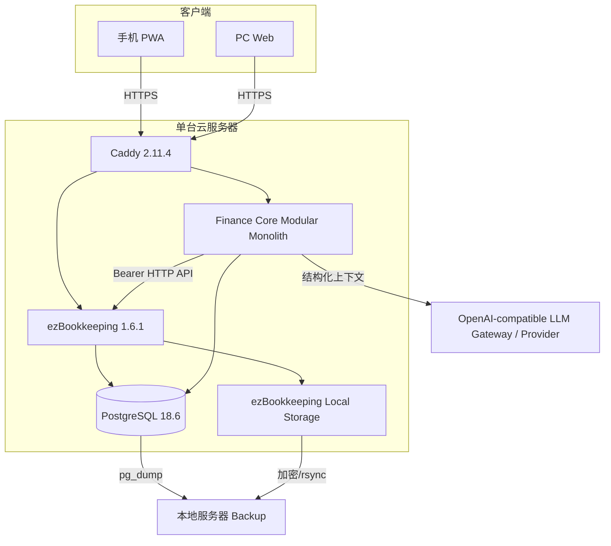

# Family Finance OS：完整项目规划

**版本：0.1**  
**规划日期：2026-08-15**  
**适用对象：中国家庭、自托管、具备服务器与开发能力的个人项目**

---

## 1. 项目定义

Family Finance OS 是一个“**家庭财务事实系统 + 确定性决策引擎 + AI 财务顾问**”。它不以“AI 自动炒股”或“聊天式记账”作为目标，而是建立可长期复用的财务闭环：

```text
可靠记录 → 财务画像 → 计算状态 → 发现问题 → 运行方案 → AI解释 → 用户决策 → 跟踪执行 → 定期复盘
```

核心成功标准：

1. 用户在中国境内外、手机或 PC 上均能通过 HTTPS 随时使用；
2. 日常记账尽可能短：手工、截图分享、AI 图片识别、账单批量导入；
3. 财务指标可复现、可测试、可解释，不能依赖 LLM 心算；
4. 能覆盖家庭现金流、预算、安全可消费金额、债务、应急资金、目标、基础资产配置；
5. AI 能结合家庭情况提供“为什么 + 怎么办 + 如果这样做会怎样”；
6. 任何重大建议都以确定性数据和情景模拟为基础；
7. 运维成本足够低：V1 一台云服务器、Docker Compose、四个核心容器；
8. 未来可平滑加入 P40、本地隐私计算、OpenClaw/MCP、家庭 RBAC、投资组合与高可用，而不推翻 V1。

---

## 2. 已核验的 2026-08-15 技术事实

本节只记录影响架构的事实，不依赖旧记忆：

- ezBookkeeping 当前最新稳定 release 为 **v1.6.1（2026-07-20）**；v1.6.0 增加 AI 文本/图片批量导入能力。
- ezBookkeeping 官方功能表确认：移动界面、HTTP API、MCP、2FA、API Token IP allowlist、AI 图片识别、Web Share Target API Level 2、AI 批量图片识别均已提供。
- ezBookkeeping 官方导入文档确认：支持支付宝 App/Web 流水、微信支付账单、京东金融账单。
- ezBookkeeping HTTP API 使用 Bearer Token；需要显式开启 `enable_api_token`。
- ezBookkeeping 正式部署官方建议 MySQL 或 PostgreSQL，而不是 SQLite；对象图片可直接使用本地 filesystem，不必引入 MinIO。
- PostgreSQL 当前 18 系列最新 minor 为 **18.6（2026-08-13）**，官方建议使用所选 major 的当前 minor；PostgreSQL 18 Docker 镜像应把卷挂载到 `/var/lib/postgresql`。
- Caddy 官方 Docker 当前提供 `2.11.4-alpine`。
- Go 当前稳定维护线为 1.26；**Go 1.26.6（2026-08-13）**包含安全与运行时修复，本项目 V1 Finance Core 采用 Go 1.26.6 基线。
- NVIDIA 将 Tesla P40 列为 legacy CUDA GPU（Compute Capability 6.1）；因此 P40 只能作为未来可替换的计算 Worker，不能成为 V1 可用性的关键路径。

完整来源与链接见 `docs/11-research-baseline-2026-08-15.md`。

### 2.1 V1 最终技术栈

```text
Ledger          ezBookkeeping 1.6.1
Finance Core    Go 1.26.6 / net/http / log/slog
Database        PostgreSQL 18.6
Data access     pgx/v5 + sqlc
Migration       goose SQL migrations
Money           int64 minor units
Rate / FX       cockroachdb/apd/v3
Frontend        Vue 3 + TypeScript + Vite + PWA + ECharts
AI              OpenAI-compatible thin provider adapter + typed Finance Tools
Proxy           Caddy 2.11.4
Deployment      Docker Compose
Optional AI     Python worker + PaddleOCR/PyTorch/P40（V1.2+）
```

V1 不使用 GORM、大型 Go Web framework、LangChain 类 Agent framework 或 Rust。Go Finance Core 保持单 binary；前端进入实现阶段后优先编译并通过 `go:embed` 合入同一 binary。

---

## 3. 产品边界

### 3.1 V1 必须完成

**数据与记账**
- ezBookkeeping 自托管；
- 手机 PWA；
- 手工记账；
- 截图 → AI 图片识别 → 用户确认；
- 支付宝/微信/京东账单导入；
- 银行 CSV/Excel 通过 ezBookkeeping 映射导入；
- 账户/分类/标签规范；
- 月度人工辅助对账流程。

**家庭财务**
- 家庭画像；
- 收入稳定性与必要支出模型；
- 现金流；
- 净资产；
- 预算；
- Safe-to-Spend（安全可消费金额）；
- 应急资金；
- 债务合同和还款策略；
- 财务目标；
- 基础资产类别与家庭风险敞口；
- What-if 情景模拟。

**AI**
- 财务问答；
- 消费解释；
- 预算建议；
- 债务方案解释；
- 目标规划；
- 大额消费前模拟；
- 月度财务报告；
- 模型 Provider 可配置，核心逻辑不绑定具体模型名称。

**可运维性**
- Docker Compose；
- HTTPS；
- PostgreSQL；
- 每日备份；
- 本地服务器异地保存；
- 有明确恢复流程；
- 健康检查；
- 版本固定与升级流程。

### 3.2 明确不放入 V1

- Kubernetes；
- PostgreSQL HA/自动 failover；
- Redis/Kafka/RabbitMQ/Temporal；
- MinIO（对象文件小规模时本地挂载即可）；
- 向量数据库；
- 微服务拆分；
- OpenClaw 关键链路；
- P40 关键链路；
- 自动银行抓取/逆向银行 App；
- 自动转账/自动还贷/自动证券买卖；
- 股票择时和个股荐股；
- 复杂复式证券成本批次核算；
- 多家庭 SaaS。

---

## 4. V1 生产架构



### 4.1 为什么 Finance Core 云端主用

“随时随地查询和建议”是硬要求。如果 Finance Core 必须经过家庭宽带或 P40，家庭断电/宽带故障会直接破坏核心体验。因此 V1 云服务器存放日常所需的交易/规划数据，本地服务器承担备份，不做必经节点。

### 4.2 为什么不做 HA

V1 的故障恢复目标是“**可恢复，不追求无感切换**”。家庭场景先保证：

- 每日备份成功；
- 可以在另一台机器恢复；
- 业务容器可以一次命令重建；
- 版本和配置在 Git 中；

只有实际使用证明单 VPS 不够，再进入 HA 阶段。

---

## 5. 数据权威边界

### 5.1 ezBookkeeping：Ledger Source of Truth

保存：
- 交易；
- 账户；
- 分类；
- 标签；
- 交易图片；
- 交易备注；
- 对账时间/状态；
- 账户余额与统计。

Finance Core **不复制成第二套可编辑交易账本**。V1 每次分析按需读取 ezBookkeeping API，并可建立短期/可重建的分析快照。

### 5.2 Finance Core：Planning Source of Truth

保存：
- Household / Member；
- 家庭财务配置；
- 收入来源与稳定性；
- 必要支出基线；
- 预算计划；
- 应急资金目标；
- 债务合同参数；
- Goals；
- 资产类别快照/配置目标；
- 风险偏好；
- 情景模拟请求与结果；
- AI 建议记录及其数据版本；
- 报告与审计元数据。

### 5.3 AI Memory 永不成为事实源

LLM 对话历史、OpenClaw memory、RAG 文档均不得覆盖 Finance Core/ezBookkeeping 中的结构化事实。

---

## 6. 中国用户数据策略

### 6.1 日常低摩擦路径

```text
微信/支付宝/银行 App 支付
           ↓
          截图
           ↓
    手机系统分享菜单
           ↓
     ezBookkeeping PWA
           ↓
       AI 图片识别
           ↓
        用户确认
           ↓
         交易入账
```

截图只解决“及时记账”，不应被视为比正式账单更高的证据。

### 6.2 月度权威对账路径

```text
支付宝 / 微信 / 京东 / 信用卡 / 银行账单
                    ↓
             ezBookkeeping Import
                    ↓
               用户预览/映射
                    ↓
                  对账
```

V1 不开发自动 Reconciliation Engine；先建立可执行的月底流程并统计真实重复率/漏账率。

### 6.3 V1.1 再做 Reconciliation

当月度重复/漏账成为真实痛点后，引入 source provenance：

```text
CAPTURED → PROVISIONAL → MATCHED → RECONCILED → FINAL
```

匹配特征至少包括：金额、账户、日期/时间窗口、商户归一名、平台流水号（若有）。正式银行/支付账单优先覆盖 AI 截图字段。

---

## 7. Finance Core 模块

V1 采用模块化单体：

```text
finance-core/
  household/
  ledger_adapter/
  analytics/
  budget/
  debt/
  goals/
  portfolio/
  scenario/
  advisor/
  reports/
  policy/
  audit/
```

模块间通过 Go package interface / typed struct 明确通信，不通过消息队列。

### 7.1 Household

家庭画像包括：家庭成员、扶养人数、收入来源、收入稳定性、必要支出、家庭阶段、风险承受能力、未来已知大额支出。

### 7.2 Cashflow / Net Worth

所有计算均由代码完成。典型输出：
- 月收入；
- 必要/可变/债务/投资支出；
- 净现金流；
- 储蓄率；
- 流动资产；
- 总资产/总负债/净资产；
- 月度变化。

### 7.3 Budget

V1 不复制 Actual Budget 的完整 envelope 功能，只实现满足家庭规划的必要集合：
- 月度预算；
- 按分类/目标额度；
- 已使用、剩余、预计月底；
- 必要/可调整/目标型三类预算；
- 可配置 rollover 在后续小版本加入。

### 7.4 Safe-to-Spend

核心指标：

```text
可用于当前周期的流动资金
- 周期结束前必须发生的固定支出
- 债务最低/计划还款
- 必要生活费保留
- 应急资金底线缺口
- 本周期强制储蓄/目标拨款
= Safe-to-Spend
```

必须明确显示：截至日期、采用的未来支出、是否含尚未入账流水、数据完整性状态。

### 7.5 Debt Engine

债务合同至少记录：
- 当前本金；
- APR/实际成本率；
- 月供/最低还款；
- 剩余期限；
- 还款日；
- 固定/浮动；
- 提前还款成本；
- 是否可循环额度；
- 用户指定优先级/约束。

算法：
- baseline 最低还款；
- Avalanche；
- Snowball；
- 自定义额外还款；
- 提前还款模拟；
- Liquidity Floor 约束。

任何“把全部现金拿去还债”的方案都必须先过应急资金/短期刚性支出约束。

### 7.6 Goals

支持：应急资金、旅游、买车、首付、教育、养老、自定义目标。

每个目标含：目标金额、当前已准备、目标日期、优先级、是否刚性、可接受延期范围。输出每月所需拨款和目标冲突。

### 7.7 Portfolio V1

只做家庭资产类别，而非证券交易系统：现金、存款、货币、固收、权益、黄金、房产、其他。目的：判断流动性、集中度和风险资产比例；不做个股择时。

### 7.8 Scenario Engine

V1 至少提供：
- `simulate_purchase`；
- `simulate_extra_debt_payment`；
- `simulate_budget_change`；
- `simulate_monthly_saving_change`；
- `simulate_goal_date`。

每次返回 before/after、关键指标变化、约束违反项和假设。

---

## 8. AI Advisor 设计

### 8.1 不可违反的边界

```text
User Question
    ↓
Intent / Parameters
    ↓
Finance Tool (deterministic)
    ↓
Structured Result + Data Quality
    ↓
LLM Explanation
```

禁止：

```text
User → LLM → 自己从几千条交易心算 → 给出确定数字
```

### 8.2 模型角色而不是固定模型名

配置层定义角色：

| Role | 用途 | 必需能力 |
|---|---|---|
| `vision_cheap` | 截图/票据识别 | Vision + JSON/结构化输出 |
| `chat_fast` | 普通财务问答 | Tool calling/JSON、低延迟 |
| `planner_strong` | 债务/年度/复杂 What-if | 强推理 + Tool calling |
| `reviewer` | 重大方案交叉检查 | 与 planner 独立或不同模型/策略 |

2026 年模型变化速度很快，因此文档只提供当前候选，不把具体名称写进核心代码。Provider 统一走 OpenAI-compatible 或明确 Adapter。

### 8.3 AI 输出格式

重大建议固定包含：
1. 当前事实；
2. 使用的数据截止时间；
3. 关键计算结果；
4. 建议；
5. 建议理由；
6. 风险/不确定性；
7. 可执行下一步；
8. 若属于重要决定，列出至少一个替代方案。

### 8.4 写权限

V1 Advisor 默认只读 Finance Core/ezBookkeeping。未来写交易时：

```text
LLM → Proposal → Server Validation → Human Approval → Command → Ledger
```

永远不提供“自动转账、自动还贷、自动证券买卖”能力。

---

## 9. 隐私与安全

### 9.1 V1

- 公网只开放 80/443；
- PostgreSQL 不映射 host 公网端口；
- Caddy 自动 TLS；
- ezBookkeeping 开启 2FA；
- API Token 仅供 Finance Core 内网访问；
- Secret 不入 Git；
- 原始截图按需要由 ezBookkeeping 本地 storage 保存；
- 云端 LLM 使用前在产品 UI 明确提示其会处理什么数据；
- Advisor 默认只发送完成任务所需的聚合/结构化数据，不发送无关交易明细。

### 9.2 P40 隐私阶段

未来将本地服务器/P40 加入：OCR → PII/语义脱敏 → 云模型。由于 P40 是 legacy GPU，必须通过兼容性和吞吐 benchmark 才进入生产；不能为迁就 P40 固定老旧依赖链。

### 9.3 家庭权限阶段

V1 若仅单一可信家庭管理员，可简化权限。需要多成员隐私后加入四级可见性：
- OWNER_ONLY；
- HOUSEHOLD_AGGREGATE；
- HOUSEHOLD_DETAIL；
- SHARED。

OpenClaw 不能被用作这一权限边界。

---

## 10. 运维模型

### 10.1 运行组件

```text
caddy
postgres
 ezbookkeeping
finance-core
```

### 10.2 备份

每日：
- `pg_dump -Fc`：finance；
- `pg_dump -Fc`：ezbookkeeping；
- ezBookkeeping `/ezbookkeeping/storage`；
- 配置由 Git 保存，secret 由独立 secret backup 保存。

保留策略（项目选择，不是外部标准）：
- 7 份日备份；
- 4 份周备份；
- 12 份月备份。

至少每月一次恢复演练；任何升级 PostgreSQL major、ezBookkeeping major/破坏性版本前先手工备份并验证可读。

### 10.3 RPO/RTO（V1 目标）

- RPO：≤ 24h（在每日备份模型下）；
- RTO：目标 ≤ 4h，允许人工恢复；
- 若实际需要缩短，再进入 HA/增量备份阶段。

---

## 11. 阶段路线总览

### Phase V0 — 基础账本上线

**目标：先开始真实使用。**

交付：
- Docker Compose；
- Caddy；
- PostgreSQL；
- ezBookkeeping；
- 手机 PWA；
- 2FA；
- 微信/支付宝分类规范；
- 截图识别；
- 月度账单导入；
- 备份脚本。

退出条件：连续 2 周日常使用；没有阻断性数据丢失/登录/移动端问题；完成一次恢复演练。

### Phase V1 — Finance Core 核心闭环（当前开发阶段）

**目标：从“能记账”变为“能管理家庭财务”。**

交付：
- ezBookkeeping Adapter；
- Household；
- Cashflow/NetWorth；
- Budget；
- Safe-to-Spend；
- Debt；
- Emergency Fund；
- Goals；
- Scenario；
- 基础 Portfolio；
- Advisor Tool Contracts；
- AI Chat；
- Dashboard；
- 月报；
- 审计元数据。

退出条件：见 `docs/08-testing-acceptance.md`；关键财务引擎有单元测试；AI 数字都能追溯到工具返回；真实账本能稳定使用 1~2 个完整账期。

### Phase V1.1 — 数据质量与自动对账

**进入条件：**真实使用中截图/账单重复、漏账或商户归一化确实造成显著维护负担。

交付：
- transaction source provenance；
- normalized merchant；
- transaction fingerprint；
- candidate matcher；
- reconcile UI；
- 正式账单覆盖 provisional 数据；
- 数据完整性评分。

### Phase V1.2 — 本地隐私 AI / P40

**进入条件：**云 Vision 成本、隐私要求或批量处理量达到明确痛点；P40 实测兼容。

交付：
- Local AI Worker Adapter；
- CPU OCR baseline benchmark；
- PP-OCR/PaddleOCR 当前稳定方案 benchmark；
- P40 benchmark；
- PII + semantic redaction；
- strict/balanced privacy mode；
- cloud fallback；
- P40 断电时主系统完全可用。

### Phase V1.3 — 投资组合与市场数据

**进入条件：**用户需要基于真实持仓做家庭风险与再平衡分析，而不仅是资产类别占比。

交付：
- instrument/position/lot（按实际需求逐步）；
- market data adapters；
- 价格时效检查；
- asset class/region/currency/sector exposure；
- concentration/risk；
- rebalance suggestions；
- 不执行交易。

### Phase V1.4 — 家庭多成员与隐私

**进入条件：**至少两个家庭成员独立使用，且存在个人/共享数据边界。

交付：
- Household membership；
- owner/shared/aggregate/detail 权限；
- Advisor 视图过滤；
- audit log；
- 成员邀请/撤销；
- 敏感字段控制。

### Phase V2 — 渠道与 Agent 生态

**进入条件：**希望在 Telegram/其他消息入口直接咨询，或希望其他 Agent 使用财务 Tools。

交付：
- Finance Core `/mcp` Adapter；
- OpenClaw Adapter；
- read-only 默认 tools；
- proposal/approval 写入机制；
- 独立权限 token；
- prompt-injection 测试集。

OpenClaw 仍是 Client，不是 Finance Brain，不是家庭安全边界。

### Phase V2.1 — 统一移动端

**进入条件：**双 PWA（ezBookkeeping + Finance UI）产生明显体验摩擦，或系统 Share/Push/离线队列要求超过 PWA 能力。

交付优先顺序：
1. Finance PWA 集成 quick actions；
2. Capacitor 封装；
3. Share Target/Push/Deep Link/本地加密队列；
4. 仍通过 Finance Core/ezBookkeeping API，不复制业务逻辑。

### Phase V3 — 高级家庭财务规划

交付：
- 12/36/60 个月现金流 forecast；
- 收入波动场景；
- 利率变化情景；
- Monte Carlo 仅用于确有随机性的问题，并明确假设；
- 教育/退休规划；
- 保险保障缺口数据模型；
- planner + reviewer 重大决策流程；
- 年度家庭财务计划。

### Phase V4 — 可靠性/高可用（按需）

**进入条件必须由实测触发：**
- 单机故障对使用造成不可接受影响；或
- RPO 必须低于每日备份；或
- RTO 必须显著低于人工恢复目标；或
- 用户数/家庭数扩大导致容量问题。

可能交付：
- PostgreSQL streaming replica / managed DB；
- 对象存储；
- 多节点 Finance Core；
- Redis 仅在共享 cache/job coordination 真有需求时；
- 监控告警升级；
- DNS/LB failover。

仍不默认引入 Kubernetes；只有部署规模真正需要编排时再评估。

---

## 12. 复杂度引入 Gate

| 技术 | V1 | 何时引入 |
|---|---|---|
| Redis | 不用 | 多 Worker 共享 cache/queue 且 PostgreSQL/进程内方案已成为瓶颈 |
| MinIO/S3 | 不用 | 单机本地附件不再满足容量/多节点/灾备要求 |
| Vector DB | 不用 | 有大量合同/报告语义检索，并证明 PostgreSQL FTS/简单索引不足 |
| OpenClaw | 不依赖 | 需要外部聊天渠道/Agent 工作流 |
| MCP | 不依赖 | 需要标准 Agent tool protocol |
| P40 | 不依赖 | 本地 OCR/隐私/成本 benchmark 证明有价值 |
| Native App | 不用 | PWA 无法满足 Share/Push/离线体验 |
| HA | 不用 | 可用性 SLO/RPO/RTO 被真实业务要求推动 |
| 微服务 | 不用 | 模块必须独立扩缩容/独立团队/独立故障域，并且单体已造成可测量问题 |

---

## 13. 财务正确性原则

1. 金额不可使用二进制 float 作为权威值；
2. 时区默认 `Asia/Shanghai`，但交易保留原发生时间/时区；
3. 收入、转账、退款、余额调整必须分开，不能把所有“入账”当收入；
4. 信用卡还款是账户间转移，不是新的消费；
5. 资产购买、投资转入、债务提款与消费必须有明确口径；
6. 储蓄率定义在配置中版本化，并在 UI 解释分子/分母；
7. 净资产快照注明价格日期；
8. 预测和建议标注假设，不混同事实；
9. 数据不完整时输出“未知/待对账”，不要用 AI 猜；
10. 测试用例必须覆盖退款、跨月、转账、信用卡、分期、负数/反向交易、跨币种等边界。

---

## 14. AI 对抗原则

需要显式测试：
- 商户备注中的 prompt injection；
- 用户要求“忽略规则直接给股票”；
- 上下文包含错误总额；
- Tool 超时/失败；
- 数据截止日期陈旧；
- 相互冲突的财务目标；
- 不完整债务 APR；
- 极端大额消费；
- 云模型不可用；
- 模型返回非法 JSON；
- AI 试图越权调用写操作。

AI 不能因为用户要求“直接告诉我答案”而绕过 deterministic tool。

---

## 15. 项目管理方式

- 使用 ADR 记录不可逆/高影响架构选择；
- V1 开发采用 TDD；
- 每个任务是可独立评审和回滚的提交；
- 版本更新先在 staging/本地验证；
- 每个完整账期复盘一次产品，而不是每天改算法；
- 对外部技术版本的“最新”判断统一更新 `docs/11-research-baseline-YYYY-MM-DD.md`，不要把聊天记忆当依据。

---

## 16. V1 完成定义

只有满足以下条件才宣布 V1 完成：

- 手机可稳定登录并完成日常记账；
- ezBookkeeping API Adapter 在真实账户上只读稳定；
- Cashflow/NetWorth/Budget/Safe-to-Spend/Debt/Goals/Scenario 有自动测试；
- Dashboard 数据与人工抽查一致；
- AI 回答中的所有数值可定位到 Tool Result；
- AI 不可直接执行高风险写操作；
- 备份成功且完成恢复演练；
- 连续至少一个完整月度周期生成报告并复盘；
- 没有 P0/P1 未解决数据正确性问题；
- 文档、部署、升级、恢复步骤可由未来的自己按文档完成。
