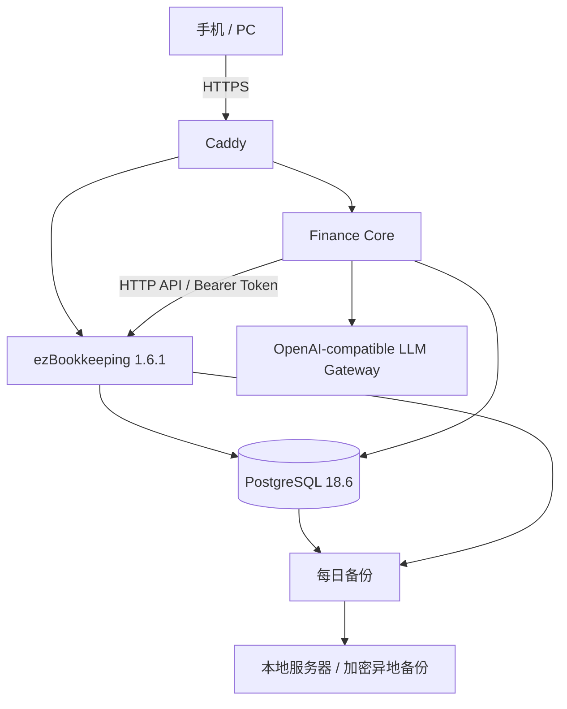

# Family Finance OS

> 面向中国家庭的自托管 AI 智能财务管家：**记账事实可靠、财务计算确定、AI 负责解释与规划**。

**规划基线日期：2026-08-15（Asia/Shanghai）**  
**仓库状态：初始化规划仓库 / V0 → V1 实施起点**

## 目标

本项目的目标不是再造一个记账软件，而是在成熟账本之上补齐家庭财务管理和 AI 顾问能力，使用户可以在手机或 PC 上随时：

- 记账：手工、文本、截图、微信/支付宝/京东账单导入；
- 查询：账户、流水、现金流、净资产、预算、债务、目标；
- 分析：消费结构、异常支出、储蓄率、流动性、财务健康度；
- 规划：预算、安全可消费金额、债务清偿、应急资金、买车/买房/教育/退休等目标；
- 决策：运行 What-if 情景模拟，再由 AI 解释利弊；
- 复盘：周报、月报、季度与年度规划；
- 后续扩展：家庭权限、本地 OCR/P40、投资组合、OpenClaw/MCP、统一移动端、高可用。

## V1 架构



V1 **明确不引入** Kubernetes、Redis、Kafka、MinIO、向量数据库、微服务、双机热备、独立 MCP Gateway、多 Agent、P40 关键依赖。

### V1 技术栈

```text
Finance Core   Go 1.26.6 + net/http + slog
Database       PostgreSQL 18.6 + pgx/v5 + sqlc + goose
Finance types  int64 Money + apd/v3 Decimal
Frontend       Vue 3 + TypeScript + Vite + PWA + ECharts
Ledger         ezBookkeeping 1.6.1
AI             OpenAI-compatible endpoint + typed tools
Proxy/Deploy   Caddy + Docker Compose
```

Python 仅在后续本地 OCR/VLM/P40 Worker 中使用；Rust 不进入 V1。

## 组件职责

| 组件 | V1 职责 | 是否权威数据源 |
|---|---|---|
| ezBookkeeping | 账户、交易、分类、标签、附件、导入、对账、手机记账 | **交易账本权威源** |
| Finance Core | 家庭画像、预算、债务合同、目标、确定性计算、情景模拟、AI 顾问 | **规划域权威源** |
| PostgreSQL | 两个逻辑数据库 | 是 |
| Caddy | TLS/反向代理 | 否 |
| LLM | 解释、建议、计划叙述 | **绝不是数字权威源** |
| 本地服务器 | V1 异地备份/恢复演练 | 灾备副本 |
| P40 | V1 不依赖；后续本地 OCR/脱敏/小模型 | 否 |
| OpenClaw | V1 不依赖；后续消息渠道 Adapter | 否 |

## 先读这些文档

1. [`PROJECT_PLAN.md`](PROJECT_PLAN.md) — 总体方案、全部阶段路线与边界。
2. [`docs/00-product-requirements.md`](docs/00-product-requirements.md) — 产品需求与非目标。
3. [`docs/01-architecture.md`](docs/01-architecture.md) — 架构与数据流。
4. [`docs/02-domain-model.md`](docs/02-domain-model.md) — 财务领域模型。
5. [`docs/04-finance-engine.md`](docs/04-finance-engine.md) — 确定性财务算法与口径。
6. [`docs/05-ai-advisor.md`](docs/05-ai-advisor.md) — AI 边界、Tool 合约、模型路由。
7. [`docs/07-operations.md`](docs/07-operations.md) — 部署、备份、升级与恢复。
8. [`docs/09-roadmap.md`](docs/09-roadmap.md) — V0~V4 路线、进入/退出条件。
9. [`docs/superpowers/plans/2026-08-15-v1-implementation-plan.md`](docs/superpowers/plans/2026-08-15-v1-implementation-plan.md) — 当前阶段实施计划。
10. [`docs/11-research-baseline-2026-08-15.md`](docs/11-research-baseline-2026-08-15.md) — 本次规划核验过的一手资料。
11. [`docs/12-model-strategy-2026-08-15.md`](docs/12-model-strategy-2026-08-15.md) — 当前模型角色、候选和项目自有 Eval 方法。

## 本地验证当前骨架

```bash
go test ./...
```

当前只实现最小 Go `/healthz` 运行骨架，业务功能按照实施计划以 TDD 逐项加入。

## 部署前准备

复制环境变量模板：

```bash
cp .env.example .env
```

生成 ezBookkeeping Secret：

```bash
openssl rand -base64 32
```

至少需要两个域名：

```text
book.example.com      -> ezBookkeeping
finance.example.com   -> Finance Core
```

部署流程和 API Token bootstrap 见 [`docs/07-operations.md`](docs/07-operations.md)。

## 设计纪律

1. **Money 不用 float。** CNY/RMB 等法币金额在内部采用整数最小货币单位或 Decimal；与 ezBookkeeping API 对接严格遵循其整数金额语义。
2. **LLM 不做财务算术。** 所有关键指标、债务模拟、预算、目标预测由 Finance Engine 返回结构化结果。
3. **AI 不直接执行高风险动作。** 交易写入使用 proposal → human approval；永不自动转账、还贷或证券交易。
4. **交易事实只有一个权威账本。** Finance Core 不维护第二套可编辑交易账本。
5. **先准确，再智能。** 账务数据质量不足时，AI 必须显示不确定性，而不是补猜。
6. **复杂度按实际指标触发。** 未来扩展必须满足 roadmap 中的进入条件，不能因“可能有用”提前引入。

## License

本初始化仓库建议在首次提交业务代码前由项目所有者选择许可证。依赖项目各自遵循其许可证；ezBookkeeping 为 MIT License。
