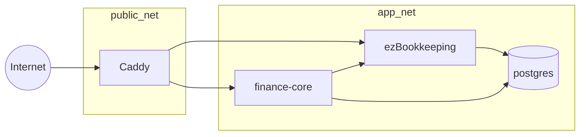

# 架构设计

## 1. 架构原则

1. 模块化单体优先；
2. 云端主用满足随时随地；
3. ezBookkeeping 负责交易事实；
4. Finance Core 负责家庭规划事实；
5. deterministic before generative；
6. P40/OpenClaw 都是可插拔 Adapter；
7. 数据正确性高于自动化程度；
8. 每个新基础设施组件必须能回答“删掉它会失去什么当前需求”。

## 2. V1 容器网络



只有 Caddy 映射主机 80/443。`postgres`、`ezbookkeeping`、`finance-core` 不对公网直接映射端口。

## 3. 读请求数据流

```text
用户 → Finance UI → Finance Core
                  ├→ Planning DB
                  └→ ezBookkeeping HTTP API
                        ↓
                  Normalize / Validate
                        ↓
                  Finance Engine
                        ↓
              Structured Tool Result
                        ↓
                     LLM
                        ↓
                 Explanation
```

## 4. 记账数据流

V1 用户直接在 ezBookkeeping PWA 中完成交易写入。Finance Core 不代理所有交易写入，避免多一层故障和维护。

## 5. 未来写入数据流

```text
AI → TransactionProposal
   → schema validation
   → policy check
   → 用户确认
   → ezBookkeeping API
   → audit record
```

## 6. 失败降级

| 故障 | V1 行为 |
|---|---|
| LLM 不可用 | 仍可记账、查看 deterministic Dashboard/指标 |
| ezBookkeeping API 不可用 | Finance Core 显示账本不可达；不编造最新数字 |
| Finance Core 不可用 | ezBookkeeping 仍可独立记账 |
| P40 不可用 | V1 无影响；未来走 CPU/cloud fallback |
| 本地备份机不在线 | 云主服务继续；备份任务记录失败并重试/告警 |
| PostgreSQL 不可用 | 明确故障，不返回旧数据伪装成功 |

## 7. 为什么两个 Web 入口暂时可接受

V1 允许：
- `book.example.com`：记账；
- `finance.example.com`：Dashboard/AI/规划。

这是主动用“少开发”换取“快上线”。只有真实使用证明切换入口是高频摩擦，才进入统一移动端阶段。
